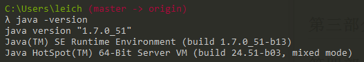
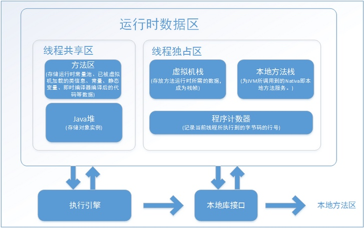
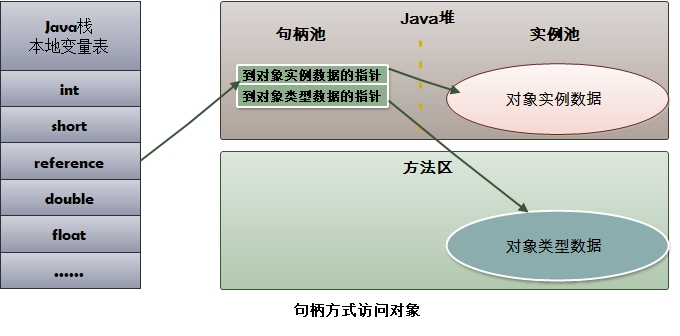
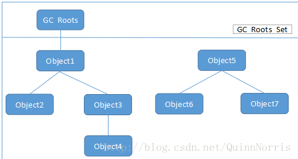
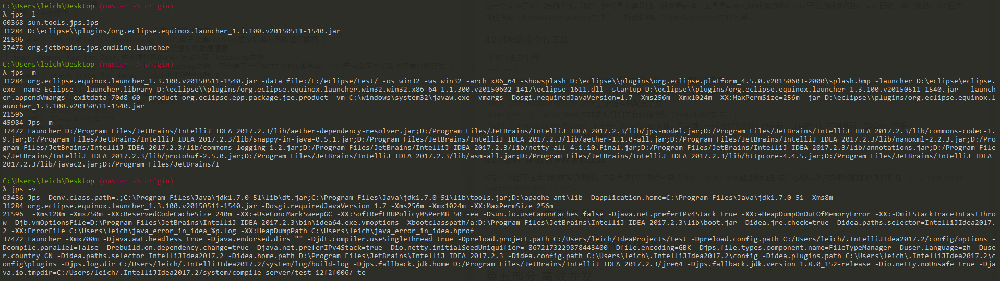
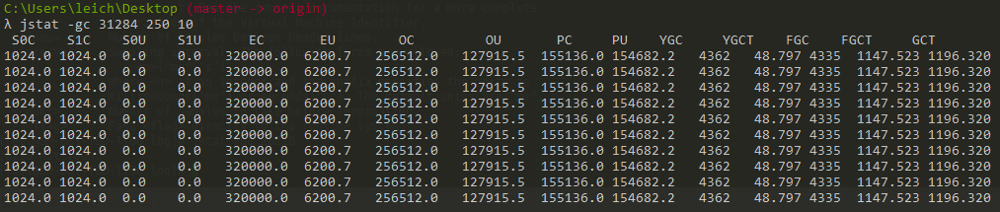
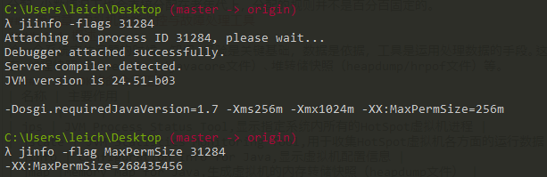
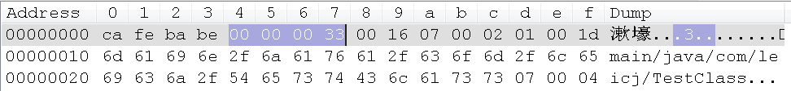

# 深入理解Java虚拟机--笔记
## 前言
1. Java的技术体系主要由支撑Java程序运行的虚拟机、提供各开发领域接口支持的Java API、Java编程语言及许多第三方Java框架（如Spring等）构成。
## 第一部分 走进Java
1. 我们可以把Java程序设计语言、Java虚拟机、Java API类库这三部分统称为JDK，JDK是用于支持Java程序开发的最小环境。
2. 我们可以把Java API类库中的Java SE API子集和Java虚拟机两部分统称为JRE（Java Runtime Environment），JRE是支持Java程序运行的标准环境。
3. HotSpot VM，是Sun JDK和OpenJDK中所带的虚拟机，也是目前使用范围最广的虚拟机。  

4. 早在JDK1.5就已经引入java.util.concurrent包实现了一个粗粒度的并发框架。而在JDK1.7中加入的java.util.concurrent.forkjoin包则是对这个框架的一次重要补充。Fork/Join模式是处理并行编程的一个经典方法。
5. Java8，提供了Lambda支持，极大改善了java语言不适合函数式编程的现状，函数式编程的一个重要的优点就是这样的程序天然的适合并行运行。
6. Java虚拟机在很早之前就退出了支持64位系统的版本。但Java程序运行在64位虚拟机上需要付出比较大的额外代价：首先是内存问题，由于指针膨胀和各种数据类型对齐补白的原因，运行于64位系统上的Java应用需要消耗更多的内存；其次，多个机构的测试结构显示，64位虚拟机运行速度在各个测试项中几乎全面落后于32位虚拟机。
## 第二部分 自动内存管理机制
### 第2章 Java内存区域与内存溢出异常
介绍Java虚拟机内存的各个区域，讲解这些区域的作用、服务对象以及其中可能产生的问题。
### 2.1 运行时数据区域
java虚拟机所管理的内存将会包括以下几个运行时数据区域，如图2-1所示  
  
图2-1 Java虚拟机运行时数据区
#### 2.1.1 程序计数器
程序计数器（Program Counter Register）是一块较小的内存空间，可以看作是当前线程所执行的字节码的行号指示器。  
为了线程切换后能恢复到正确的执行位置，每条线程都需要有一个独立的程序计数器，各条线程之间计数器互不影响，独立存储，我们称这类内存区域为“线程私有”的内存。  
此内存区域是唯一一个在Java虚拟机规范中没有规定任何OutOfMemoryError情况的区域。
#### 2.1.2 Java虚拟机栈
Java虚拟机栈（Java Virtual Machine Stacks）也是线程私有的。虚拟机栈描述的是Java方法执行的内存模型：每个方法在执行的同时都会创建一个栈帧（Stack Frame）用于存储局部变量表、操作数栈、动态链接、方法出口等信息。每一个方法从调用直至执行完成的过程，都对应着一个栈帧在虚拟机栈中入栈到出栈的过程。  
局部变量表存放了编译期可知的各种基本数据类型（boolean、byte、char、short、int、float、double）、对象引用（reference类型，它不等同于对象本身，可能是一个指向对象起始地址的引用指针，也可能是指向一个代表对象的句柄或其他与此对象相关的位置）和returnAddress类型(指向了一条字节码指令的地址）。  
在Java虚拟机规范中。对这个区域规定了两种异常情况：如果线程请求的深度大于虚拟机所允许的深度，将抛出StackOverflowError异常；如果虚拟机可以动态扩展，如果扩展无法申请到足够的内存，就会抛出OutOfMemoryErroe异常。  
#### 2.1.3 本地方法栈
与虚拟机栈一样，本地方法栈也会抛出StackOverflowError和OutOfMemoryError异常。  
#### 2.1.4 Java堆
(1) Java堆是被所有线程共享的一块区域，在虚拟机启动时创建。  
(2) Java堆是垃圾收集器管理的主要区域。现代垃圾收集器基本都采用分代收集算法，所以Java堆中还可以细分为：新生代和老年代。在细致一点的有Eden空间、From survivor空间、To survivor空间等。从内存分配的角度来看，线程共享的Java堆中可能划分出多个线程私有的分配缓存区域（Thread Local Allocation Buffer，TLAB）。  
(3) Java堆可以处于物理上不连续的内存空间上，只要逻辑上是连续的即可。  
(4) 当前主流的虚拟机内存大小都是按照可扩展来实现的（通过-Xmx和-Xms控制）。  
(5) 如果在堆中没有内存完成示例分配，并且堆也无法再扩展时，将会抛出OutOfMemoryError异常。
#### 2.1.5 方法区
(1) 方法区（Method Area）与java堆一样，是各个线程共享的内存区域，它用于存储已经被虚拟机加载的类信息、常量、静态变量、即时编译器编译后的代码等数据。  
(2) 方法区的内存回收目标只要是针对常量池的回收和类型的卸载。  
(3) 当方法区无法满足内存分配需求时，将会抛出OutOfMemoryError异常
#### 2.1.6 运行时常量池
运行时常量池（Running Constant Pool)是方法区的一部分。---------------String类的intern()方法。
#### 2.1.7 直接内存
在JDK1.4中新引入了NIO（New Input/Output)类，引入了一种基于通道（Channel）与缓冲区（Buffer）的I/O方式。
### 2.2 HotSpot虚拟机对象探秘
#### 2.2.1 对象的创建
(1) 虚拟机遇到一条new指令时，首先将去检查这个指令的参数是否能在常量池定位到一个类的符号引用，并且检查这个符号引用代表的类是否已被加载、解析和初始化过。如果没有，那必须先执行相应的加载过程。  
(2) 在类加载检查过后，接下来虚拟机将为新生对象分配内存。对象所需的内存的大小在类加载完成后便可完全确定。假设Java堆中的内存是绝对规整的，所有用的内存都放在一边，空闲的内存放在另一边，中间放着一个指针作为分界点的提示器，那分配内存就仅仅是把那个指针向空闲列表的那边挪动一段与对象大小相等的距离，这种分配方式称为“指针碰撞”(Bump the Pointer)。如果Java堆中的内存并不是规整的，已使用的内存和空闲的内存相互交错，那就没有办法简单地进行指针碰撞了，虚拟机就必须维护一个列表，记录上哪些内存是可用的，在分配的时候从列表中找到一块足够大的空间划分给对象实例，并更新列表上的记录，这种分配方式称为“空闲列表”(Free List)。选择哪种分配方式由Java堆是否规整决定的，而Java堆是否规整又由所采用的垃圾回收器是否带有压缩整理功能决定的。
(3) 内存分配完成后，虚拟机需要将飞配的内存空间都初始化为零值（不包括对象头），如果使用TLAB，这一工作也可以提前至TLAB分配时进行。  
(4) 接下来，虚拟机要对对象进行必要的设置，例如这些对象是哪个类的实例、如何才能找到类的元数据信息、对象的哈希码、对象的GC分代年龄等信息。这些信息存放在对象的对象头（Object Header）之中。  
(5) 执行init方法，把对象按照程序员的意愿进行初始化。
#### 2.2.2 对象的内存布局
(1) 在HotSpot虚拟机中，对象在内存中存储的布局可以分为3块区域：对象头（Header）、实例数据（Instance Data）和对齐填充（Padding)。    
(2) HotSpot虚拟机的对象头包含两部分信息：第一部分用于存储对象自身的运行时数据，如哈希码（HashCode）、GC分代年龄、锁状态标准、线程持有的锁等。另外一部分是类型指针，即对象指向它的元数据的指针，虚拟机通过这个指针来确定这个对象是哪个类的实例。另外，如果对象是一个java数组，那么对象头中还必须有一块用于记录数组长度的数据。  
(3) 实例数据部分是对象真正存储的有效信息，也是在程序代码中所定义的各种类型的字段内容。  
(4) 对齐填充没有特别的含义，仅仅起着占位符的作用。
#### 2.2.3 对象的访问定位
建立对象是为了使用对象，我们的Java程序需要通过栈上的reference数据来操作堆上的具体对象。目前主流的访问方式由使用句柄和直接指针两种。  
(1) 如果使用句柄的话，那么java堆将会划分出一块内存来使用句柄池，reference中存储的就是对象的句柄地址，而句柄中包含了对象实例数据和类型数据各自的具体地址信息，如图2-2所示。  
  
(2) 如果使用直接指针访问，那么java堆对象的布局中就必须考虑如何放置访问类型数据的相关信息，而reference中存储的直接就是对象地址，如图2-3所示  
  
(3) 使用句柄最大的好处就是reference中存储的是稳定的句柄地址，在对象被移动（垃圾收集时移动对象是非常普遍的行为）时只会改变句柄中的实例数据指针，而reference本身不需要修改。  
(4) 使用直接指针访问方式的最大好处就是速度更快。  
#### 2.3 实战：OutOfMemoryError异常
(1) -Xms -Xmx -Xss -XX:HeapDunpOnOutOfMemoryError -XX:MaxPermSize  -Xmn
(2) 在单线程下，无论是由于栈帧太大还是虚拟机栈容量太小，当内存无法分配时，虚拟机抛出的都是StackOverflowError异常。  
**待解决问题：**  
(1) 代码2-7  
(2) 内存溢出和内存泄漏的区别  
(3) Eclipse Memory Analyzer 分析堆转储文件  
### 第三章 垃圾收集器与内存分配策略
### 3.1 概述
(1) GC需要完成的事情：  
① 哪些内存需要回收？  
② 什么时候回收？  
③ 如何回收？  
(2) 第2章介绍了Java内存运行时区域的各个部分，其中程序计数器、虚拟机栈、本地方法栈3个区域随线程而生，随线程而灭。这几个区域就不需要过多考虑回收问题，因为方法结束或者线程结束时，内存自然就跟随着回收了。  
(3) Java堆和方法区，一个接口中的多个实现类需要的内存可能不一样，一个方法中的多个分支需要内存也可能不一样，我们只有在程序处于运行期间才能知道会创建哪些对象，这部分内存的分配和回收都是动态的，垃圾收集器所关注的是这部分内存。  
### 3.2 对象已死吗
#### 3.2.1 引用计数法
主流Java虚拟机里面没有选用引用计数法来管理内存，其中最主要的原因是它很难解决对象之间相互循环引用的问题。
#### 3.2.2 可达性分析算法
在主流的商用语言的主流实现中，都是称通过可达性分析（Reachability Analysis）来判断对象是否存活。这个算法的基本思路就是通过一系列的称为“GC Roots”的对象作为起始点，从这些节点开始向下搜索，搜索所走过的路径称为引用链（Reference Chain），当一个对象到GC Roots没有任何引用链相连时，则证明对象是不可用的。  
  
在Java语言中，可作为GC Roots的对象包括下面几种：  
① 虚拟机栈（栈帧中的本地变量表）中引用的对象  
② 方法区中类静态属性引用的对象  
③ 方法区中常量引用的对象  
④ 本地方法栈中JNI（即一般说的Native方法）引用的对象  
#### 3.2.3 再谈引用
引用分为强引用（Strong Reference）、软引用（Soft Reference）、弱引用（Weak Reference)、虚引用（Phantom Reference) 4种，这4种引用强度依次逐渐减弱。  
① 强引用就是指在程序代码之中普遍存在的，类似“Object obj = new Object()”这类的引用，只要强引用还存在，垃圾回收器永远不会回收掉被引用的对象。  
② 软引用用来描述一些还有用但并非必需的对象。对于软引用关联的对象，在系统将要发生内存溢出异常之前，将会把这些对象列进回收范围之中进行第二次回收。  
③ 弱引用用来描述非必需对象的。当垃圾收集器工作时，无论当时内存是否足够，都会回收掉只被弱引用关联的对象。    
④ 虚引用，是最弱的一种引用关系。为一个对象设置虚引用关联的唯一目的就是能在这个对象被收集器回收时收到一个系统通知。    
#### 3.2.4 生存还是死亡
即使在可达性分析算法中不可达的对象，也并非是“非死不可”的，这个时候它们暂时处于“缓刑”阶段，要真正宣告一个对象死亡，至少要经历两次标记过程：如果对象在进行可达性分析后发现没有与GC Roots相关联的引用链，那么它将会被第一次标记并且进行一次筛选，筛选的条件是才对象是否有必要执行finalize()方法。当对象没有覆盖finalize方法，或者finalize方法已经被虚拟机调用过，虚拟机将这两种情况都视为“没有必要执行”。  
如果这个对象被判定为有必要执行finalize方法，那么这个对象将会放置在一个叫做F-Queue的队列中，并在稍后由一个虚拟机自动建立的、低优先级的Finalize线程去执行它。finalize()方法时对象逃脱死亡命运的最后一次机会，稍后GC将对F-Queue中的对象进行第二次小规模的标记，如果对象要在finalize()中成功拯救自己---只要重新与引用链上的任何一个对象建立关联即可，譬如把自己（this关键字）赋值给某个变量或者对象的成员变量，那么第二次标记时它将会被移出“即将回收”的集合；如果对象这时候还没有逃脱，那基本上它就真的被回收了。
#### 3.2.5 回收方法区
永久代的垃圾集主要回收两部分内容：废弃常量和无用的类。
### 3.3 垃圾收集算法
#### 3.3.1 标记-清除算法
Mark-Sweep，只要有两个不足：一个是效率问题，另一个是空间问题。
#### 3.3.2 复制算法
现在的商业虚拟机都采用这种收集算法来回收新生代，将内存分为一个较大的Eden空间和两块较小的survivor空间，每次使用Eden和其中的一个Survivor。当回收时，将Eden和Survivor中还存活的对象一次性的复制到另外一块Survivor空间上，最后清理掉Eden和刚才用过的Survivor空间。HotSpot虚拟机默认的Eden和Survivor的大小比例是8：1。
#### 3.3.3 标记-整理算法
Mark-Compact，老年代使用该算法
### 3.4 理解GC日志
```
VM args:-verbose:gc -XX:+PrintGCDetails
```  
```
[GC [PSYoungGen: 4761K->536K(38400K)] 4761K->536K(124416K), 0.0067884 secs] [Times: user=0.00 sys=0.00, real=0.01 secs] 
[Full GC [PSYoungGen: 536K->0K(38400K)] [ParOldGen: 0K->467K(86016K)] 536K->467K(124416K) [PSPermGen: 2445K->2444K(21504K)], 0.0317866 secs] [Times: user=0.06 sys=0.00, real=0.03 secs] 
Heap
 PSYoungGen      total 38400K, used 1997K [0x00000007d5d00000, 0x00000007d8780000, 0x0000000800000000)
  eden space 33280K, 6% used [0x00000007d5d00000,0x00000007d5ef3468,0x00000007d7d80000)
  from space 5120K, 0% used [0x00000007d7d80000,0x00000007d7d80000,0x00000007d8280000)
  to   space 5120K, 0% used [0x00000007d8280000,0x00000007d8280000,0x00000007d8780000)
 ParOldGen       total 86016K, used 467K [0x0000000781800000, 0x0000000786c00000, 0x00000007d5d00000)
  object space 86016K, 0% used [0x0000000781800000,0x0000000781874f78,0x0000000786c00000)
 PSPermGen       total 21504K, used 2453K [0x000000077c600000, 0x000000077db00000, 0x0000000781800000)
  object space 21504K, 11% used [0x000000077c600000,0x000000077c865748,0x000000077db00000)
```  
GC日志开头的“[GC”和“[Full GC”说明了这次垃圾收集的停顿类型。  
“[PSYoungGen”、“[ParOldGen”、“[PSPermGen”表示GC的区域，这里显示的区域名称与使用的GC收集器是密切相关的。如果所使用的是Serial收集器，则新生代是显示“DefNew”,如果是采用Parallel Scavenge收集器，则是“PSYoungGen”。  
后方括号内部“4761K->536K(38400K)”含义“GC前该区域已使用容量->GC后该区域已使用容量（该区域的总容量）”，而在方括号之外的“4761K->536K(124416K)”表示“GC前Java堆已使用容量->GC后Java堆已使用容量（Java堆总容量）”。
### 3.5 内存分配与回收策略
对象的内存分配，往大方向讲，就是在堆上分配，对象主要分配在新生代的Eden区上，如果启动了本地线程分配缓存，将按线程优先在TLAB上分配。少数情况下也会直接分配在老年代上，分配的规则并不是百分百固定的。
### 第四章 虚拟机性能监控与故障处理工具
#### 4.1 概述
给一个系统定位问题的时候，知识、经验是关键基础，数据是依据，工具是运用处理数据的手段。这里说的数据包括：运行日志、异常堆栈、GC日志、线程快照（threaddump/javacore文件）、堆转储快照（heapdump/hrpof文件）等。
#### 4.2 JDK的命令行工具
| 名称 | 主要作用 |  
| ---- | --- |  
| jps | JVM Process Status Tool,显示指定系统内所有的HotSpot虚拟机进程 |  
| jstate | JVM Statistics Monitoring Tool,用于收集HotSpot虚拟机各方面的运行数据 |  
| jinfo | Configuration Info for Java,显示虚拟机配置信息 |  
| jmap |Memory Map for Java,生成虚拟机的内存转储快照（heapdump文件） |  
| jhat | JVM Heap Dump Browser,用于分析heapdump文件，它会建立一个HTTP/HTML服务器，让用户可以在浏览器上查看分析结果 |  
| jstack | Stack Trace for Java,显示虚拟机的快照线程 |  
#### 4.2.1 jps：虚拟机进程状况工具
功能：列出正在运行的虚拟机进程，并显示虚拟机执行主类（Main Class，main函数所在的类）名称以及这些进程的本地虚拟机唯一ID（Local Virtual Machine Identifier，LVMID）。  
  
#### 4.2.2 jstat：虚拟机统计信息监控工具
jstat用于监控虚拟机各种运行状态信息的命令行工具。它可以显示本地或者远程虚拟机加载的类装载、内存、垃圾收集、JIT编译等运行数据。
jstat的命令格式为：  
jstat [option vmid [interval [s|ms] [count]] ]  
 
查询结果表明：S0（Survivor0）大小为1024.0，S1（Survivor1）大小为1024.0，S0、S1的使用率为0.0，Eden区大小为320000.0，使用了6200.7，老年代（O，表示Old）和永久代（P，表示Permanent）的大小以及使用了多少。程序运行以来共发生Minor GC（YGC表示） 4362次，总耗时（YGCT表示）48.797秒，发生Full GC（FGC表示）4335次，总耗时(FGCT表示）1147.523秒，所有GC总耗时（GCT表示） 1196.320秒。
#### 4.2.3 jinfo：Java配置信息工具
 
#### 4.3 JDK的可视化工具
#### 4.3.1 JConsole：Java监视与管理平台
JConsole（Java Monitoring and Management Console）是一种基于JMX的可视化监视、管理工具。
#### 4.3.2 VisualVM:多合一故障处理工具
VisualVM（All-in-One Java Troubleshooting Tool)是目前为止随JDK发布的功能最强大的运行监控和故障处理程序，并且可以预见在未来的一段时间内都是官方主力发展的虚拟机故障处理工具。
## 第三部分 虚拟机执行子系统
### 第6章 类文件结构
代码编译的结果从本地机器码转变为字节码，是存储格式发展的一小步，却是编程语言发展的一大步。
#### 6.1 概述
由于最近10年虚拟机以及大量建立在虚拟机之上的程序语言如雨后春笋般出现并蓬勃发展，将我们编写的程序编译成二进制本地机器码已不再是唯一的选择，越来越多的程序语言选择了与操作系统和机器指令集无关的、平台中立的格式作为程序编译后的存储方式。
#### 6.2 无关性的基石
各种不同平台的虚拟机与所有平台都统一使用的程序存储格式--字节码（ByteCode）是构成平台无关性的基石。  
实现语言无关性的基础仍然是虚拟机和字节码存储格式。
#### 6.3 Class类文件的结构
1. Class文件是一组以8位字节为基础单位的二进制流，各个数据项目严格按照顺序紧凑的排列在Class文件之中，中间没有添加任何分隔符，这使得整个Class文件中存储的内容几乎全部是程序运行的必要数据，没有空隙存在。  
2. Class文件格式统一采用一种类似于C语言结构体的伪结构存储数据，这种伪结构中只有两种数据类型：无符号数和表。
3. 无符号数属于基本数据类型，以u1、u2、u4、u8来分别代表1个字节、2个字节、4个字节、8个字节的无符号数，无符号数可以用来描述数据、索引引用、数量值或者按照UTF-8编码构成字符串值。
4. 表是由多个无符号数或者其他表作为数据项构成的复合数据类型，所有表都习惯的以“_info”结尾。表用于描述有层次关系的复合结构的数据，整个Class文件本质上就是一张表，它由表6-1所示的数据项构成。  
**表6-1 Class文件格式**  

| 类型 | 名称 | 数量 |  
| ---- | ---- | ---- |  
| u4 | magic | 1 |  
| u2 | minor_version |1 |  
| u2 | major_version | 1 |  
| u2 | constant_pool_count | 1 |  
| cp_info | constant_pool | constant_pool_count-1 |  
| u2 | access_flags | 1 |  
| u2 | this_class | 1 |  
| u2 | super_class | 1 |  
| u2 | interfaces_count | 1 |  
| u2 | interfaces | interfaces_count |  
| u2 | fields_conut | 1 |  
| field_info | fields | fields_count |  
| u2 | methods_count | 1 |  
| method_info | methods | methods_count |  
| u2 | attributes_count | 1 |  
| attribute_info | attributes | attributes_count |  
##### 6.3.1 魔数与Class文件的版本
1. 每个Class文件的头4个字节称为魔数（Magic Number），它的唯一作用是确定这个文件是否为一个能被虚拟机接收的Class文件。Class文件的魔数值为：0xCAFEBABE。  
2. 紧接着魔数的4个字节存储的是Class文件的版本号：第5和第6个字节是次版本号（Minor Version），第7个和第8个字节是主版本号（Major Version）。  
**图6-2** Java Class文件的结构
  
注：notePad++使用十六进制编辑器（HEX-Editor）打开Class文件  
##### 6.3.2 常量池
1. 紧接着主版本号之后的是常量池入口。
2. 由于常量池中常量的数量是不固定的，所以在常量池的入口需要放置一项u2类型的数据，代表常量池容量计数值（constant_pool_count)。与Java中语言习惯不一样的是，这个数据容量计数是从1而不是0开始的，常量池容量为十六进制数0x0016，即十进制的22，这就代表常量池中有21项常量，索引值范围为1 ~ 21。
3. 常量池中主要存放两大类常量：字面量（Literal）和符号引用（Symbolic References）。字面量比较接近于Java语言层面的常量概念，如文本字符串、声明为final的常量值等。而符号引用则属于编译原理方面的概念，包括了下面三类常量：  
- 类和接口的全限定名（Fully Qualified Name）  
- 字段的名称和描述符（Descriptor）
- 方法的名称和描述符
## 第四部分 程序编译与代码优化
## 第五部分 高效并发